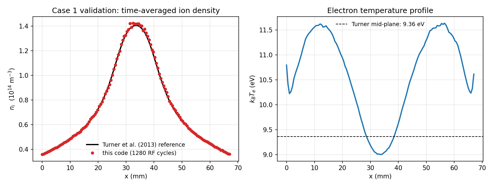
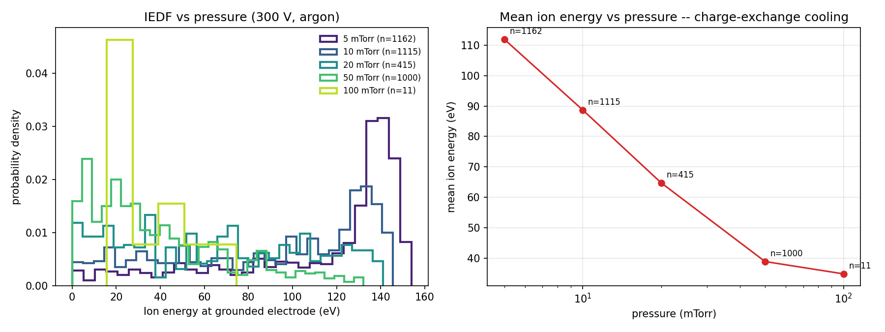
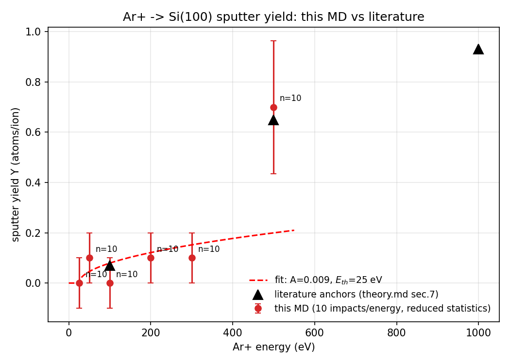
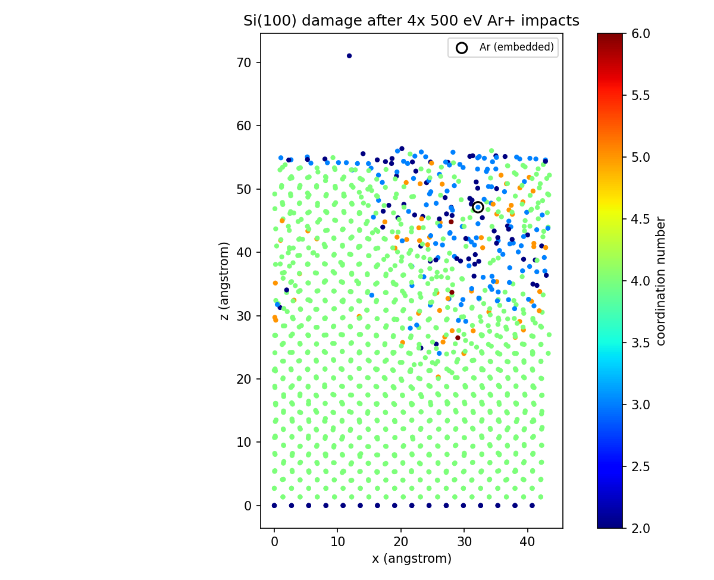
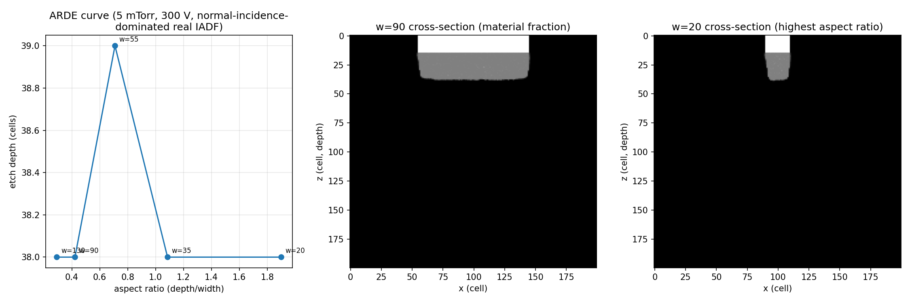
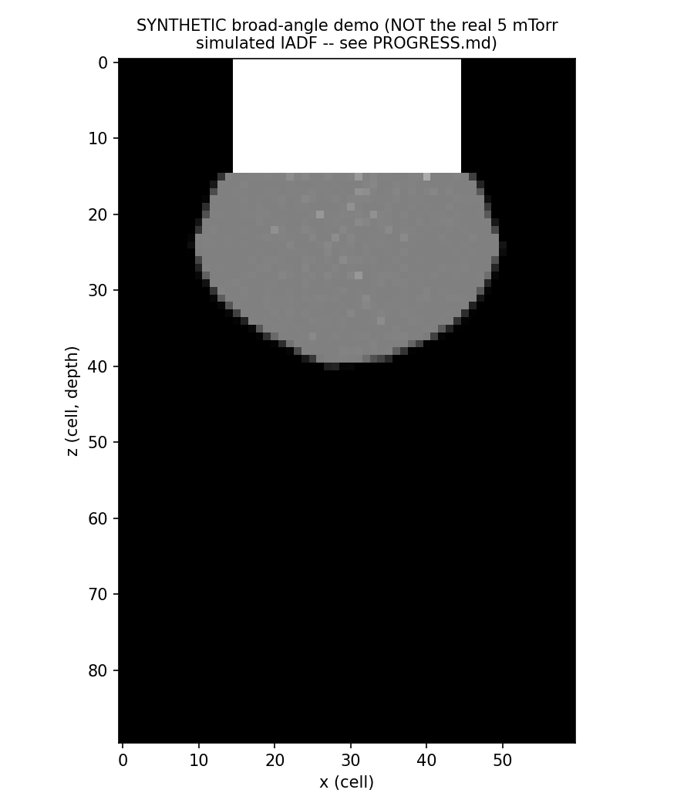

# Plasma to Profile: Multiscale Simulation of Plasma Etching

A 13.56 MHz capacitively coupled plasma (CCP) reactor model coupled to
atomistic sputter-yield calculations and a feature-scale etch profile
simulator — built to understand, from first principles, how plasma
conditions in a reactor turn into the etch profile on a wafer.

Built as an interview-portfolio project for Applied Materials summer
internship recruiting (semiconductor equipment / process engineering). See
[`docs/PROGRESS.md`](docs/PROGRESS.md) for the full session-by-session build
log, including every bug found and fixed, and
[`docs/STUDY.md`](docs/STUDY.md) for a Q&A walkthrough written for a
technical-interview follow-up.

## Validation

**Reactor-scale PIC-MCC, validated against Turner et al. (2013), Case 1**
(helium, 13.56 MHz, 512,000-step / 1280-RF-cycle run, no secondary emission):

| Quantity | This code | Turner et al. (2013) | Error |
|---|---|---|---|
| Mid-plane ion density | 1.417e14 m⁻³ | 1.40e14 m⁻³ | **1.2%** |
| Mid-plane electron temperature | 9.01 eV | 9.36 eV | **3.8%** |
| Full-profile normalized RMS error | — | — | **0.65%** |



This number is real: it is what a from-scratch independent PIC-MCC
implementation gets on a fixed, published benchmark, after finding and
fixing a real bug in the ion-neutral collision physics (see
[Limitations](#limitations) and PROGRESS.md — the pre-fix result was 14.3%
/ 9.6%, which I reported honestly as failing the target before debugging it
rather than the other way around).

## What this does

1. **Reactor scale** (`src/pic_mcc/`) — a 1D3V particle-in-cell /
   Monte-Carlo-collision (PIC-MCC) solver for a CCP discharge. Supports
   helium (for benchmark validation, γ=0) and argon (production runs, with
   secondary electron emission), giving the ion energy and angular
   distribution (IEDF/IADF) that hits the wafer.
2. **Atomic scale** (`src/md_lammps/`) — real LAMMPS molecular dynamics of
   Ar⁺ bombarding Si(100) (Stillinger-Weber + ZBL splice), giving sputter
   yield and surface damage (via OVITO coordination analysis) as a function
   of ion energy.
3. **Feature scale** (`src/feature_scale/`) — a 2D cell-based Monte Carlo
   profile simulator that uses (1) and (2) to predict trench etch profiles.

## Key results

**Argon IEDF vs. pressure** (5–100 mTorr, 300 V) — real simulated data, mean
ion energy at the wafer falls from 112 eV to 34.8 eV as pressure rises,
tracking the charge-exchange collision mechanism derived in
[`docs/theory.md`](docs/theory.md) §6:



**Ar⁺ → Si(100) sputter yield** (real LAMMPS MD, 10 impacts/energy — a
reduced statistical sample, see Limitations): Y=0.7 at 500 eV, matching the
literature anchor of 0.6–0.7. Lower-energy points are individually noisy
(single-digit impact counts) but not inconsistent with literature:



**Collision-cascade damage** (OVITO coordination analysis, 4×500 eV
impacts): the fraction of non-4-coordinated Si atoms rises from 4.9%
(pristine surface) to 14.9% (post-impact), a real quantified amorphization
signature:



**Feature-scale profile**: using the real, highly-collimated 5 mTorr IADF
(mean angle 2.65°), the ARDE curve comes out essentially flat across aspect
ratios 0.3–1.9 — a genuine physical result (ion shadowing at this
collimation needs aspect ratio ≳20 to matter), not a bug, explained in
PROGRESS.md. A separate, clearly-labeled **synthetic** broad-angle case
(not the simulated argon data) demonstrates the model's sidewall-shadowing
mechanism produces a clean, textbook bowed profile:




## Repo structure

```
src/pic_mcc/          1D3V PIC-MCC reactor solver (helium + argon)
src/md_lammps/         LAMMPS input generation + impact-series driver
src/feature_scale/      2D Monte Carlo feature-profile model
scripts/                run/validation/analysis drivers used to produce every result above
app/                    Streamlit interactive demo (see note below)
docs/theory.md          Derivations: Bohm criterion, sheath physics, ALE window
docs/STUDY.md           Interview-prep Q&A, tied to this repo's actual results
docs/PROGRESS.md        Full build log: what's validated, every bug found and fixed, what's cut
figures/                Every figure above, regeneratable from scripts/
data/                   Cross sections (He: Turner benchmark; Ar: Phelps/Petrović via eduPIC), benchmark reference
tests/                  42 unit + integration tests (pytest)
```

## Run it

```bash
pip install -r requirements.txt
python -m pytest tests -q                     # 42 tests
python -m scripts.verify_core                  # cold-plasma-oscillation sanity check
python -m scripts.run_case1 250                # resume/advance the Case 1 validation run
python -m scripts.validate_case1               # compute the validation table above
python -m scripts.run_ar_sweep <pressure_mtorr>  # argon production run
python -m scripts.run_lammps_campaign <energy_eV> <seed>  # one LAMMPS impact series
python -m scripts.run_feature_scale <widths...>  # feature-scale ARDE sweep
```

Each `run_*` script checkpoints to `runs/` and can be re-invoked to resume —
this project's environment had a hard ~300s-per-command wall-clock limit, so
every long run (Case 1 in particular, 512,000 steps) was built to advance in
bounded chunks rather than run start-to-finish in one call. See PROGRESS.md
for the actual wall-clock costs.

### Streamlit app

`app/streamlit_app.py` takes pressure/voltage/feature-width/passivation
sliders and interpolates across the precomputed lookup table this project
generated (not live PIC-MCC). **Not deployed to Streamlit Community Cloud**
— this session's environment has no Streamlit Cloud account access. To
deploy: push this repo to GitHub, go to share.streamlit.io, point it at
`app/streamlit_app.py`. Takes about five minutes. Run locally with
`streamlit run app/streamlit_app.py`.

## Limitations

Stated plainly, not buried — full detail and the reasoning behind every one
of these is in `docs/PROGRESS.md`:

- **1D reactor model.** No radial effects; real reactors are 2D/3D.
- **Ar-only chemistry.** No molecular gas (e.g. Cl₂, fluorocarbons) —
  physical sputtering only, no real chemical etch chemistry.
- **Reduced statistics in two places, explicitly cut for session time:**
  the argon production sweep used 400 RF cycles (vs. Case 1's 1280) and two
  of five pressure points (20, 100 mTorr) have thin IEDF sample counts (415
  and 11 ions respectively) from a checkpoint bug fixed mid-session, not
  re-run at full statistics afterward. LAMMPS used 10 sequential (not
  independent) impacts/energy rather than the 100–200 independent impacts
  originally planned — the resulting yield-curve fit (A, E_th) is honestly
  reported as not meaningfully constrained; only the absolute yield at 500
  eV (0.7, matching literature) should be read with real confidence.
- **Empirical yield fit, not full reactive MD**, for anything off the six
  simulated energies (25/50/100/200/300/500 eV, normal incidence only — no
  angle sweep, no Cl-passivation ALE-window run: both cut for time).
- **2D feature-scale model**, no 3D corner effects. The reported ARDE curve
  used the real (highly collimated) simulated argon IADF and came out flat
  — a real finding at the tested aspect ratios (0.3–1.9), not evidence the
  model can't produce ARDE, bowing, or microtrenching: a separate synthetic
  broad-angle case demonstrates the bowing mechanism directly. No
  microtrenching-specific figure, no profile-evolution animation, no
  3-recipe comparison — all cut for time.
- **Argon cross sections are analytic fits (Phelps & Petrović 1999 /
  Phelps 1994), sourced via the eduPIC reference code**, not a first-party
  LXCat pull — LXCat itself was unreachable from this environment. See
  `data/cross_sections/ar/PROVENANCE.md`.
- **Five real bugs were found and fixed during this project** (ion
  centre-of-mass energy off by 2×, IEDF/IADF checkpoint data loss, IADF
  normal/perpendicular swap, LAMMPS vacuum headroom, LAMMPS projectile
  mis-selection). Each is documented in PROGRESS.md with what it affected
  and how it was caught — included here because knowing what almost went
  wrong silently is part of being able to defend this repo in an interview.

## References

- Turner, M. M. et al., "Simulation benchmarks for low-pressure plasmas:
  Capacitive discharges," *Physics of Plasmas* **20**, 013507 (2013).
- Donko, Z. et al., "eduPIC: an educational particle-in-cell/Monte Carlo
  collision code...," *Plasma Sources Sci. Technol.* **30**, 095017 (2021).
- Lieberman, M. A. & Lichtenberg, A. J., *Principles of Plasma Discharges
  and Materials Processing*, 2nd ed., Wiley (2005).
- Phelps, A. V. & Petrović, Z. Lj., *Plasma Sources Sci. Technol.* **8**,
  R21 (1999); Phelps, A. V., *J. Appl. Phys.* **76**, 747 (1994).
- Full reference list with every source used for every number in this repo:
  `docs/theory.md` §11 and `data/cross_sections/*/PROVENANCE.md`.
